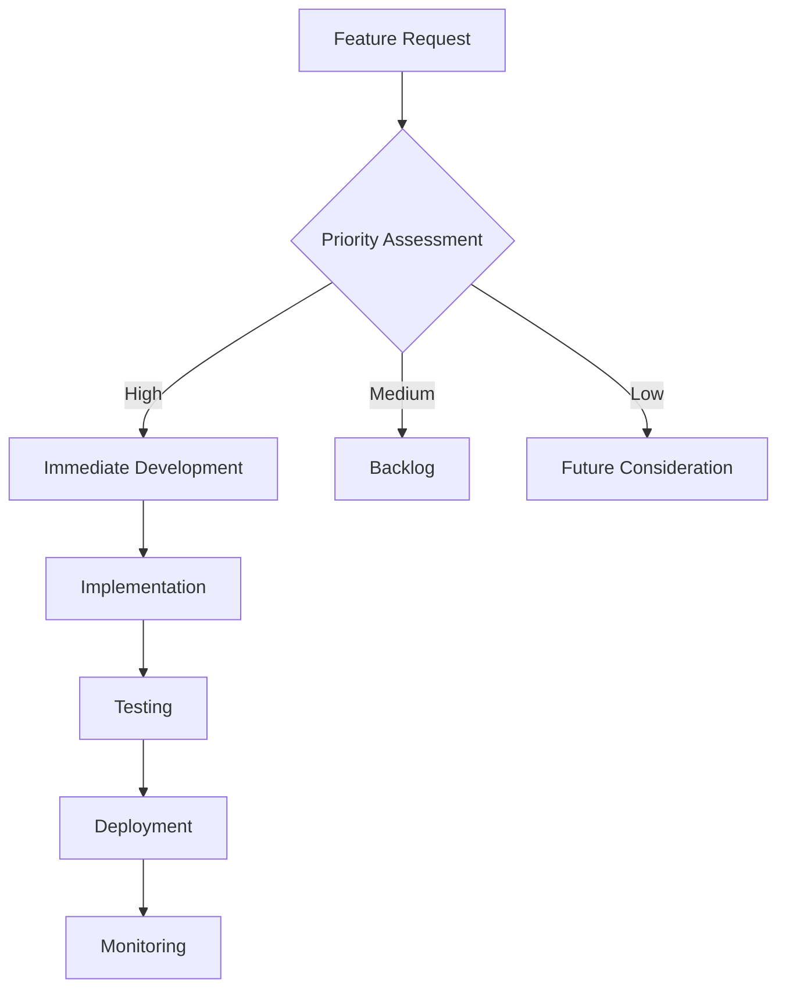

# AI Tools Directory - Technical Documentation

## 🏗️ Application Architecture

### Frontend Structure
```
src/
├── assets/         # Static assets and images
├── components/     # Reusable UI components
├── contexts/       # React context providers
├── data/          # Static data and configurations
├── hooks/         # Custom React hooks
├── pages/         # Page components
├── routes/        # Routing configuration
├── services/      # API service layers
├── utils/         # Utility functions
└── theme/         # Theme configuration
```

## 🔑 Core Components

### Authentication System
- Implements JWT-based authentication
- Protected routes using `PrivateRoute` component
- User session management via `AuthContext`
- Login/Register forms with validation

### Main Features

#### 1. Tool Management
- Tool listing with advanced filtering
- Category-based organization
- Search functionality
- Detailed tool views
- Rating and review system

#### 2. User Features
- Favorite tools management
- Personal collections
- User profiles
- Tool recommendations

#### 3. Admin Features
- Tool CRUD operations
- User management
- Category management
- Analytics dashboard

## 📱 Pages and Routes

### Public Pages
- `/` - Home page with featured tools
- `/tools` - Tool directory with filters
- `/categories` - Category browsing
- `/about` - About page
- `/login` & `/register` - Authentication pages

### Protected Pages
- `/dashboard` - User dashboard
- `/favorites` - Favorite tools
- `/collections` - User collections
- `/profile` - User profile management

### Admin Pages
- `/admin/tools` - Tool management
- `/admin/users` - User management
- `/admin/categories` - Category management
- `/admin/analytics` - Usage analytics

## 🔌 API Integration

### Endpoints Structure
```
/api/
├── auth/
│   ├── login
│   ├── register
│   └── refresh-token
├── tools/
│   ├── GET / - List tools
│   ├── POST / - Create tool
│   ├── GET /:id - Get tool
│   ├── PUT /:id - Update tool
│   └── DELETE /:id - Delete tool
├── categories/
│   ├── GET / - List categories
│   └── POST / - Create category
├── users/
│   ├── GET /profile
│   └── PUT /profile
└── favorites/
    ├── GET /my
    └── POST /toggle/:id
```

## 🛠️ Technical Implementation

### State Management
- React Context API for global state
- Custom hooks for shared logic
- Local state for component-specific data

### UI Components
1. **Navigation**
   - Responsive header
   - Mobile menu
   - Dark mode toggle

2. **Tool Cards**
   - Image display
   - Rating display
   - Quick actions
   - Category badges

3. **Filters**
   - Search input
   - Category filter
   - Price range filter
   - Sort options

4. **Forms**
   - Input validation
   - Error handling
   - Loading states
   - Success feedback

### Authentication Flow
1. User enters credentials
2. JWT token received
3. Token stored in localStorage
4. Auth context updated
5. Protected routes accessible

### Data Flow
1. API requests via axios
2. Response handling
3. State updates
4. UI updates
5. Error handling

## 🎨 Styling and Theme

### Design System
- Tailwind CSS for styling
- Custom color palette
- Responsive design
- Dark mode support

### Components
- Custom button styles
- Form elements
- Card layouts
- Modal designs

## 🔒 Security Measures

1. **Authentication**
   - JWT token validation
   - Protected routes
   - Session management

2. **Data Protection**
   - Input sanitization
   - XSS prevention
   - CSRF protection

3. **API Security**
   - Rate limiting
   - Request validation
   - Error handling

## 📊 Performance Optimization

1. **Code Splitting**
   - Route-based splitting
   - Component lazy loading
   - Dynamic imports

2. **Caching**
   - API response caching
   - Static asset caching
   - State persistence

3. **Image Optimization**
   - Lazy loading
   - Responsive images
   - Format optimization

## 🧪 Testing Strategy

### Unit Tests
- Component testing
- Hook testing
- Utility function testing

### Integration Tests
- API integration
- Route protection
- State management

### E2E Tests
- User flows
- Authentication
- CRUD operations

## 📱 Responsive Design

### Breakpoints
```css
sm: 640px   // Small devices
md: 768px   // Medium devices
lg: 1024px  // Large devices
xl: 1280px  // Extra large devices
2xl: 1536px // 2X Extra large devices
```

### Mobile Optimization
- Touch-friendly interfaces
- Responsive images
- Adaptive layouts
- Mobile navigation

## 🚀 Deployment

### Build Process
1. Environment configuration
2. Asset optimization
3. Code minification
4. Bundle generation

### Hosting Requirements
- Node.js environment
- SSL certificate
- Environment variables
- Static file serving

## 🔄 Continuous Integration

### Workflow
1. Code push
2. Automated tests
3. Build process
4. Deployment
5. Monitoring

## 📈 Monitoring and Analytics

### Metrics Tracked
- User engagement
- Performance metrics
- Error rates
- API usage

### Tools Used
- Error tracking
- Performance monitoring
- Usage analytics
- User feedback

## 🔧 Maintenance

### Regular Tasks
- Dependency updates
- Security patches
- Performance optimization
- Bug fixes

### Documentation
- Code comments
- API documentation
- Component documentation
- Setup guides

## 🆘 Error Handling

### Client-Side
- API error handling
- Form validation
- Network error recovery
- State management errors

### Server-Side
- Request validation
- Database errors
- Authentication errors
- Rate limiting

## 🌐 Internationalization

### Implementation
- Language detection
- Translation files
- RTL support
- Date/time formatting

## 📱 Progressive Web App

### Features
- Offline support
- Push notifications
- App-like experience
- Installation prompt

## 🔐 Privacy and Compliance

### Measures
- Data protection
- Cookie consent
- Privacy policy
- Terms of service

## 🎯 Future Enhancements

1. **Features**
   - Advanced search
   - AI recommendations
   - Social sharing
   - Tool comparisons

2. **Technical**
   - Performance optimization
   - Enhanced security
   - Better analytics
   - Mobile app version

3. **User Experience**
   - Improved onboarding
   - Better notifications
   - Enhanced profiles
   - Social features

## 🎯 Feature Analysis

### ✅ Implemented Features

#### 1. Authentication System
- [x] JWT-based user authentication
- [x] User registration with validation
- [x] Secure password management
- [x] Protected routes
- [x] Session management
- [x] Profile settings & customization

#### 2. Tool Management
- [x] Tool listing with filters
- [x] Category-based organization
- [x] Advanced search functionality
- [x] Tool details view
- [x] Rating system
- [x] Favorite tools
- [x] Tool collections
- [x] Tool submission

#### 3. AI Features
- [x] AI chatbot integration
- [x] Smart prompt generation
- [x] AI-powered recommendations
- [x] Automated tool categorization
- [x] Smart search suggestions

#### 4. User Dashboard
- [x] Personalized dashboard
- [x] Favorite tools management
- [x] Collection organization
- [x] Activity tracking
- [x] Settings management
- [x] Profile customization

#### 5. Admin Features
- [x] Tool management interface
- [x] User management
- [x] Category management
- [x] Analytics dashboard
- [x] Content moderation

### 🚧 Ongoing Development

#### 1. Enhanced AI Integration
```javascript
// Current implementation in AIChatbot.jsx
const [chatHistory, getChatResponse, isLoading] = useAI();
// Planned improvements:
- Multi-model support
- Context-aware responses
- Personalized recommendations
- Learning from user interactions
```

#### 2. Advanced Search
```javascript
// Current search implementation
const [searchTerm, setSearchTerm] = useState('');
// Planned enhancements:
- Semantic search
- Fuzzy matching
- Filter combinations
- Search history
```

#### 3. Social Features
```javascript
// Planned social features
- User collaboration
- Tool reviews
- Community discussions
- Expert recommendations
- Social sharing
```

#### 4. Performance Optimization
```javascript
// Current loading state
const [loading, setLoading] = useState(true);
// Planned optimizations:
- Code splitting
- Lazy loading
- Caching strategies
- Image optimization
```

### 📋 Pending Features

#### 1. Advanced Analytics
- [ ] User behavior tracking
- [ ] Tool usage analytics
- [ ] Performance metrics
- [ ] A/B testing framework
- [ ] Custom reports

#### 2. Integration Features
- [ ] API key management
- [ ] Webhook support
- [ ] Third-party integrations
- [ ] Export/Import functionality
- [ ] Backup systems

#### 3. Enhanced Security
- [ ] 2FA implementation
- [ ] OAuth providers
- [ ] Rate limiting
- [ ] IP blocking
- [ ] Audit logging

#### 4. Monetization Features
- [ ] Premium subscriptions
- [ ] Tool marketplace
- [ ] Affiliate system
- [ ] Payment processing
- [ ] Billing management

### 🔄 Feature Implementation Workflow



### 📊 Feature Priority Matrix

| Feature | Priority | Complexity | Status |
|---------|----------|------------|---------|
| AI Chat Enhancement | High | High | Ongoing |
| Social Features | Medium | Medium | Pending |
| Analytics Dashboard | High | Medium | Ongoing |
| API Integration | Medium | High | Pending |
| Security Updates | High | High | Ongoing |

### 🎯 Implementation Goals

#### Q3 2024
1. **AI Enhancement**
   - Improved context awareness
   - Multi-model support
   - Custom training

2. **Search Optimization**
   - Semantic search
   - Advanced filters
   - Search analytics

3. **Social Features**
   - User profiles
   - Community features
   - Collaboration tools

#### Q4 2024
1. **Analytics**
   - Custom dashboards
   - Export capabilities
   - Trend analysis

2. **Security**
   - 2FA implementation
   - Enhanced monitoring
   - Compliance updates

3. **Marketplace**
   - Tool submissions
   - Review system
   - Premium features

### 🔍 Testing Strategy

#### Unit Tests
```javascript
describe('Tool Management', () => {
  test('Create Tool', async () => {
    // Test implementation
  });
  test('Update Tool', async () => {
    // Test implementation
  });
  test('Delete Tool', async () => {
    // Test implementation
  });
});
```

#### Integration Tests
```javascript
describe('AI Features', () => {
  test('Chat Response', async () => {
    // Test implementation
  });
  test('Recommendations', async () => {
    // Test implementation
  });
});
```

### 📈 Performance Metrics

#### Current Metrics
- Page Load Time: < 2s
- Time to Interactive: < 3s
- First Contentful Paint: < 1.5s
- API Response Time: < 200ms

#### Target Metrics
- Page Load Time: < 1.5s
- Time to Interactive: < 2s
- First Contentful Paint: < 1s
- API Response Time: < 150ms

### 🔧 Technical Debt

#### Current Issues
1. **Code Organization**
   - Component structure refinement
   - Context optimization
   - Type definitions

2. **Performance**
   - Bundle size optimization
   - Memory management
   - Cache implementation

3. **Testing**
   - Test coverage increase
   - E2E test implementation
   - Performance testing

#### Resolution Timeline
- Q3 2024: Code organization
- Q4 2024: Performance optimization
- Q1 2025: Testing enhancement

## 📂 Detailed Folder Analysis

### 1. Components Directory (`/src/components/`)
```
components/
├── admin/         # Admin-specific components
├── ai/           # AI-related components
├── auth/         # Authentication components
├── common/       # Shared components
├── profile/      # User profile components
├── tools/        # Tool-related components
├── ui/           # UI elements
└── core files    # Root component files
```

#### Core Components
- `ErrorBoundary.jsx` - Error handling wrapper
- `FavoriteButton.jsx` - Tool favoriting functionality
- `Footer.jsx` - Site footer with navigation
- `Header.jsx` - Main site header
- `LoadingSpinner.jsx` - Loading state indicator
- `Navbar.jsx` - Main navigation component
- `ToolCard.jsx` - Tool display card
- `ToolsFilter.jsx` - Tool filtering interface

#### Feature-Specific Components
1. **Admin Components**
   - Tool management interface
   - User management dashboard
   - Analytics components
   - Category management

2. **AI Components**
   - AI recommendations engine
   - Smart search components
   - AI-powered filters

3. **Auth Components**
   - Login form
   - Registration form
   - Password reset
   - Authentication guards

4. **Profile Components**
   - User profile editor
   - Settings management
   - Activity history

### 2. Pages Directory (`/src/pages/`)
```
pages/
├── Dashboard/    # User dashboard views
├── SmartPrompts/ # AI prompt management
├── admin/        # Admin pages
├── api/          # API documentation
└── core pages    # Main application pages
```

#### Main Pages
- `Home.jsx` - Landing page with featured tools
- `Categories.jsx` - Category browsing interface
- `Tools.jsx` - Main tools directory
- `ToolDetails.jsx` - Individual tool view
- `About.jsx` - About page
- `SubmitTool.jsx` - Tool submission form
- `NotFound.jsx` - 404 error page

#### Dashboard Section
- User statistics
- Favorite tools
- Collections
- Activity tracking
- Settings management

#### SmartPrompts Section
- Prompt creation
- Template management
- AI interaction history

### 3. Contexts Directory (`/src/contexts/`)
```
contexts/
├── AuthContext.jsx    # Authentication state
├── ToolsContext.jsx   # Tools management
├── ThemeContext.jsx   # Theme preferences
└── AIContext.jsx      # AI features state
```

#### Context Features
1. **AuthContext**
   - User authentication state
   - Login/logout functions
   - Token management
   - Permission checks

2. **ToolsContext**
   - Tool data management
   - Filtering state
   - Sorting preferences
   - Category management

3. **ThemeContext**
   - Dark/light mode
   - Color scheme
   - UI preferences

4. **AIContext**
   - AI recommendations
   - Smart search state
   - Prompt management

### 4. Services Directory (`/src/services/`)
```
services/
├── api/          # API integration
├── auth/         # Authentication
├── storage/      # Data storage
└── analytics/    # Usage tracking
```

#### Service Features
1. **API Service**
   - RESTful endpoints
   - Request interceptors
   - Response handling
   - Error management

2. **Auth Service**
   - Token management
   - Session handling
   - OAuth integration
   - Permission validation

3. **Storage Service**
   - Local storage
   - Cache management
   - State persistence
   - File handling

### 5. Utils Directory (`/src/utils/`)
```
utils/
├── api.js        # API utilities
├── auth.js       # Auth helpers
├── formatting.js # Data formatting
└── validation.js # Input validation
```

#### Utility Functions
1. **API Utilities**
   - Request formatting
   - Response parsing
   - Error handling
   - Rate limiting

2. **Auth Helpers**
   - Token validation
   - Permission checks
   - Role management
   - Session utilities

3. **Formatting Utilities**
   - Date formatting
   - Number formatting
   - Text sanitization
   - Data transformation

### 6. Hooks Directory (`/src/hooks/`)
```
hooks/
├── useAuth.js     # Authentication hooks
├── useTools.js    # Tools management
├── useTheme.js    # Theme management
└── useForm.js     # Form handling
```

#### Custom Hooks
1. **Authentication Hooks**
   ```javascript
   useAuth() => {
     isAuthenticated: boolean
     user: User
     login: (credentials) => Promise
     logout: () => void
     updateProfile: (data) => Promise
   }
   ```

2. **Tools Hooks**
   ```javascript
   useTools() => {
     tools: Tool[]
     loading: boolean
     error: Error
     filters: Filters
     pagination: Pagination
     setFilters: (filters) => void
   }
   ```

### 7. Data Directory (`/src/data/`)
```
data/
├── categories/    # Category definitions
├── templates/     # UI templates
├── prompts/       # AI prompts
└── constants/     # App constants
```

#### Data Management
1. **Categories**
   - Category hierarchies
   - Tool classifications
   - Taxonomy management

2. **Templates**
   - Email templates
   - Notification templates
   - UI component templates

3. **Prompts**
   - AI interaction templates
   - Smart search patterns
   - Recommendation rules

### 8. Theme Directory (`/src/theme/`)
```
theme/
├── colors.js      # Color definitions
├── typography.js  # Text styles
├── spacing.js     # Layout spacing
└── components.js  # Component styles
```

#### Theme Configuration
1. **Colors**
   - Primary palette
   - Secondary colors
   - Semantic colors
   - Dark mode variants

2. **Typography**
   - Font families
   - Text sizes
   - Line heights
   - Font weights

3. **Spacing**
   - Grid system
   - Margins
   - Paddings
   - Layout rules

```
