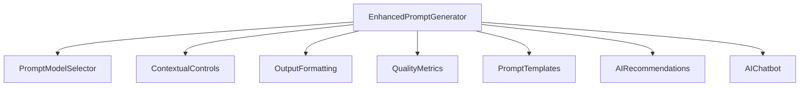

# Advanced AI Prompt Generator - Technical Documentation & Enhancement Plan

## Table of Contents
1. [System Overview](#system-overview)
2. [Current Architecture](#current-architecture)
3. [Core Components](#core-components)
4. [Enhancement Proposals](#enhancement-proposals)
5. [Integration Guide](#integration-guide)
6. [Technical Specifications](#technical-specifications)

## System Overview

The Advanced AI Prompt Generator is a sophisticated system designed to create, optimize, and manage AI prompts through an intuitive interface. The system leverages multiple AI models and advanced NLP techniques to generate high-quality, context-aware prompts.

### Key Features
- Multi-model prompt generation pipeline
- Real-time quality analysis
- Context-aware prompt optimization
- Template management system
- Advanced configuration controls

## Current Architecture

### Frontend Components


### State Management
- React Context API for global state
- Local component state for UI
- Real-time synchronization
- Optimistic updates

### API Integration
- REST endpoints for prompt generation
- WebSocket for real-time features
- Rate limiting and caching
- Error handling and retry logic

## Core Components

### 1. Prompt Generation Pipeline
Current Implementation:
```javascript
- Initial prompt generation (Primary Model)
- Quality analysis
- Iterative improvement (Secondary Models)
- Post-processing and formatting
```

### 2. Quality Analysis System
Metrics:
- Clarity Score
- Specificity Index
- Coherence Rating
- Relevance Assessment
- Pattern Detection

### 3. Template Management
Features:
- Category-based organization
- Customizable templates
- Version control
- Usage analytics

## Enhancement Proposals

### 1. Advanced AI Features

#### 1.1 Multi-Modal Prompt Generation
- Image-to-prompt generation
- Voice-to-prompt conversion
- Code-aware prompt generation
- Multi-language support with automatic translation

#### 1.2 Advanced Learning Capabilities
- Personalized prompt suggestions based on user history
- A/B testing for prompt effectiveness
- Automated prompt optimization
- Collaborative filtering for template recommendations

#### 1.3 Context Enhancement
- Project-specific context awareness
- Domain-specific terminology integration
- Semantic role labeling
- Named entity recognition

### 2. User Experience Improvements

#### 2.1 Interactive Prompt Builder
- Drag-and-drop prompt components
- Visual prompt flow designer
- Real-time preview
- Syntax highlighting for different prompt parts

#### 2.2 Advanced Analytics Dashboard
- Prompt performance metrics
- Usage patterns visualization
- Quality trends analysis
- ROI calculations for premium features

#### 2.3 Collaboration Features
- Team workspaces
- Prompt sharing and forking
- Comments and annotations
- Version control with diff viewing

### 3. Technical Enhancements

#### 3.1 Performance Optimization
- Implement WebAssembly for heavy computations
- Advanced caching strategies
- Lazy loading of complex features
- Worker threads for background processing

#### 3.2 Security Improvements
- End-to-end encryption for sensitive prompts
- Role-based access control
- Audit logging
- Compliance monitoring

#### 3.3 Integration Capabilities
- REST API expansion
- WebSocket support for real-time features
- Webhook system for external integrations
- SDK development for third-party integration

## Integration Guide

### 1. Backend Integration

#### API Endpoints
```javascript
POST /api/v1/prompts/generate
POST /api/v1/prompts/analyze
GET /api/v1/prompts/templates
POST /api/v1/prompts/optimize
```

#### WebSocket Events
```javascript
PROMPT_UPDATE
QUALITY_ANALYSIS
COLLABORATIVE_EDIT
REAL_TIME_SUGGESTIONS
```

### 2. Frontend Integration

#### Context Provider Setup
```javascript
import { AIProvider } from './contexts/AIContext';

<AIProvider>
  <EnhancedPromptGenerator />
</AIProvider>
```

#### Hook Usage
```javascript
const { generatePrompt, analyzeQuality } = useAI();
```

## Technical Specifications

### 1. System Requirements

#### Frontend
- React 18+
- Node.js 16+
- Modern browser with WebAssembly support

#### Backend
- Node.js 16+
- MongoDB 5+
- Redis for caching
- WebSocket support

### 2. Performance Targets
- Initial prompt generation: < 2s
- Quality analysis: < 1s
- Template loading: < 500ms
- Real-time updates: < 100ms

### 3. Scalability Considerations
- Horizontal scaling for API servers
- Distributed caching
- Load balancing
- Database sharding

## Implementation Roadmap

### Phase 1: Core Enhancement
1. Implement multi-modal support
2. Enhance quality analysis system
3. Add advanced template management
4. Develop interactive prompt builder

### Phase 2: Advanced Features
1. Roll out collaboration features
2. Implement advanced analytics
3. Add AI-powered optimization
4. Develop personalization system

### Phase 3: Integration & Scale
1. Release public API
2. Implement WebSocket features
3. Add third-party integrations
4. Deploy scaling solutions

## Best Practices

### 1. Prompt Design
- Use clear, concise language
- Include context and constraints
- Specify output format
- Consider edge cases

### 2. Quality Assurance
- Automated testing
- Manual review process
- Performance monitoring
- User feedback collection

### 3. Security
- Regular security audits
- Data encryption
- Access control
- Compliance checking

## Monitoring & Maintenance

### 1. Performance Monitoring
- Response time tracking
- Error rate monitoring
- Resource usage analysis
- User experience metrics

### 2. Quality Metrics
- Prompt success rate
- User satisfaction score
- System reliability
- Feature adoption rate

### 3. Maintenance Schedule
- Weekly security updates
- Monthly feature releases
- Quarterly performance reviews
- Annual architecture assessment

## Future Considerations

### 1. Emerging Technologies
- Integration with new AI models
- Quantum computing readiness
- Edge computing capabilities
- Blockchain integration for prompt verification

### 2. Market Trends
- Industry-specific customization
- Mobile-first features
- Privacy-focused enhancements
- Enterprise integration capabilities

### 3. Research Areas
- Advanced NLP techniques
- Prompt chain optimization
- Context understanding
- Multi-modal processing

## Conclusion

The Enhanced AI Prompt Generator represents a sophisticated system with significant potential for advancement. By implementing the proposed enhancements and following the integration guidelines, the system can evolve into a more powerful and versatile tool for AI prompt generation and management.

Regular updates to this documentation will be made as new features are implemented and best practices evolve.
