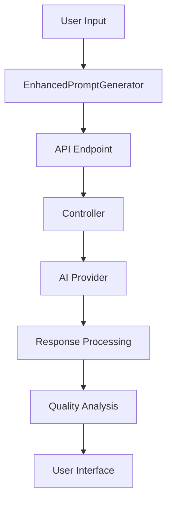
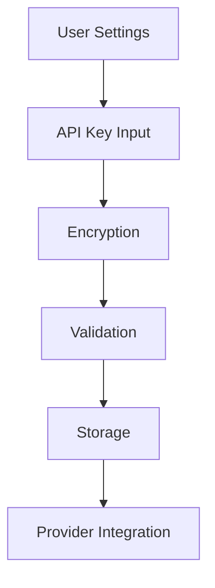

# AI Module Documentation

## Table of Contents
1. [Frontend Components](#frontend-components)
2. [API Endpoints](#api-endpoints)
3. [Backend Server](#backend-server)
4. [Integration Flow](#integration-flow)
5. [Security & Authentication](#security--authentication)
6. [Data Models](#data-models)

## Frontend Components

### 1. EnhancedPromptGenerator
Location: `src/components/ai/EnhancedPromptGenerator.jsx`

Primary component for generating AI-enhanced prompts with advanced features:

#### Features:
- Multi-model prompt generation
- Context-aware prompting
- Quality analysis
- Template management
- Real-time optimization

#### Subcomponents:
- **PromptModelSelector**: AI model selection and configuration
- **ContextualControls**: Context and domain settings
- **OutputFormatting**: Response format customization
- **QualityMetrics**: Prompt quality analysis
- **PromptTemplates**: Template management

#### State Management:
```javascript
const [prompt, setPrompt] = useState('');
const [config, setConfig] = useState({
  models: { primary: 'gpt-4', secondary: ['claude-2', 'palm-2'] },
  context: { domain: 'general', industry: 'tech' },
  parameters: { temperature: 0.7, topP: 0.9 },
  features: { chainOfThought: true, fewShotLearning: true }
});
```

### 2. AIChatbot
Location: `src/components/ai/AIChatbot.jsx`

Interactive chatbot interface for AI interactions:

#### Features:
- Real-time chat interface
- Message history
- Typing indicators
- Response streaming
- Context maintenance

#### Key Functions:
```javascript
const handleSubmit = async (message) => {
  await getChatResponse(message);
};

useEffect(() => {
  // Auto-scroll to latest messages
  chatContainerRef.current?.scrollTo(0, chatContainerRef.current.scrollHeight);
}, [messages]);
```

### 3. AIRecommendations
Location: `src/components/ai/AIRecommendations.jsx`

Smart recommendation system for AI tools and features:

#### Features:
- Personalized recommendations
- Usage-based suggestions
- Category filtering
- Relevance scoring

## API Endpoints

### 1. Prompt Generation API
Location: `src/pages/api/generate-prompt.js`

#### Endpoints:
\`\`\`javascript
POST /api/generate-prompt
{
  topic: string,
  model: string,
  type: 'creative' | 'technical' | 'marketing' | 'academic',
  tone: string,
  length: string,
  temperature: number
}
\`\`\`

### 2. Settings API
Location: `src/pages/api/settings/`

#### API Keys Management:
\`\`\`javascript
GET /api/settings/api-keys
POST /api/settings/api-keys
DELETE /api/settings/api-keys
\`\`\`

#### Model Availability:
\`\`\`javascript
GET /api/settings/available-models
\`\`\`

#### API Key Testing:
\`\`\`javascript
POST /api/settings/test-api-key
\`\`\`

## Backend Server

### 1. Routes
Location: `server/routes/`

#### AI Prompt Routes:
\`\`\`javascript
POST /api/v1/prompts/generate
GET /api/v1/prompts/templates
POST /api/v1/prompts/analyze
\`\`\`

#### Authentication Routes:
\`\`\`javascript
POST /api/v1/auth/login
POST /api/v1/auth/register
POST /api/v1/auth/refresh-token
\`\`\`

#### API Key Routes:
\`\`\`javascript
GET /api/v1/provider-api-keys
POST /api/v1/provider-api-keys
DELETE /api/v1/provider-api-keys/:id
\`\`\`

### 2. Controllers
Location: `server/controllers/`

#### AIPromptController:
- generatePrompt()
- analyzePrompt()
- getTemplates()
- saveTemplate()

#### SmartPromptController:
- enhancePrompt()
- optimizeContext()
- generateVariations()
- analyzeQuality()

### 3. Middleware
Location: `server/middleware/`

#### Authentication:
- validateToken()
- refreshToken()
- validatePermissions()

#### Rate Limiting:
- requestRateLimit()
- tokenRateLimit()
- costBasedRateLimit()

## Integration Flow

### 1. Prompt Generation Flow:


### 2. API Key Management Flow:


## Security & Authentication

### 1. API Key Security:
- Encryption at rest
- Secure transmission
- Key rotation support
- Access control

### 2. Request Authentication:
- JWT tokens
- Session management
- Role-based access
- Rate limiting

## Data Models

### 1. User Model:
\`\`\`javascript
{
  id: string,
  email: string,
  apiKeys: {
    openai: string,
    anthropic: string,
    cohere: string
  },
  preferences: {
    defaultModel: string,
    defaultContext: object
  }
}
\`\`\`

### 2. Prompt Model:
\`\`\`javascript
{
  id: string,
  userId: string,
  content: string,
  type: string,
  metadata: {
    model: string,
    quality: object,
    usage: object
  },
  createdAt: Date
}
\`\`\`

## Usage Examples

### 1. Generate Enhanced Prompt:
\`\`\`javascript
const response = await fetch('/api/generate-prompt', {
  method: 'POST',
  body: JSON.stringify({
    topic: 'AI Ethics',
    model: 'openai/gpt-4',
    type: 'academic',
    tone: 'professional',
    length: 'detailed'
  })
});
\`\`\`

### 2. Manage API Keys:
\`\`\`javascript
const response = await fetch('/api/settings/api-keys', {
  method: 'POST',
  body: JSON.stringify({
    provider: 'openai',
    apiKey: 'sk-...'
  })
});
\`\`\`

## Best Practices

### 1. Error Handling:
- Comprehensive error messages
- Graceful degradation
- Retry mechanisms
- User feedback

### 2. Performance:
- Request caching
- Response compression
- Lazy loading
- Resource optimization

### 3. Security:
- Input validation
- Output sanitization
- Rate limiting
- Access control

## Monitoring & Maintenance

### 1. Performance Monitoring:
- Response times
- Error rates
- Resource usage
- User metrics

### 2. Security Monitoring:
- Access logs
- Error logs
- API usage
- Security events

### 3. Maintenance Tasks:
- Regular updates
- Security patches
- Performance optimization
- Feature updates
